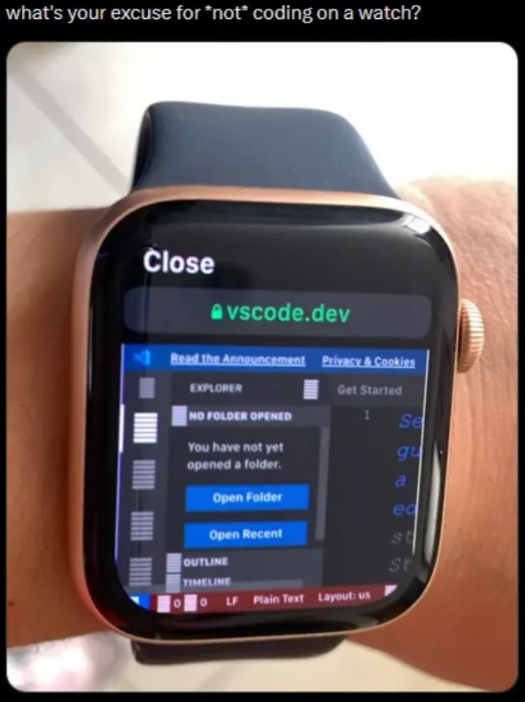
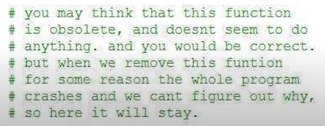
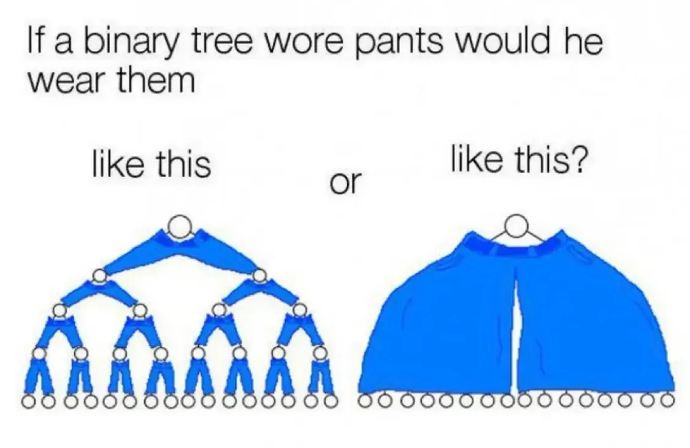
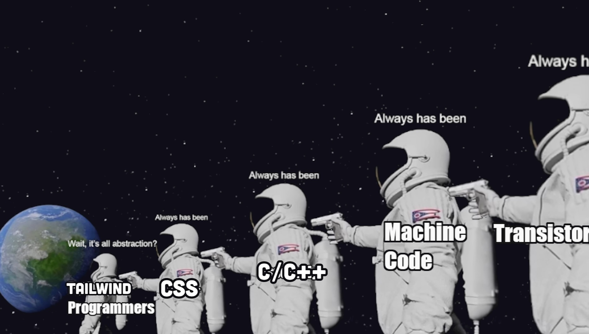

# Meme Collection

A collection of 20 memes, sorted from newest to oldest.

## Memes

## How to Contribute

1. Clone this repository
2. Add your memes to the `memes` directory
3. Run `npm start` to organize memes and update README
4. Commit and push your changes

## License

This repository is for educational and entertainment purposes only.
All images may be subject to copyright by their respective owners.
